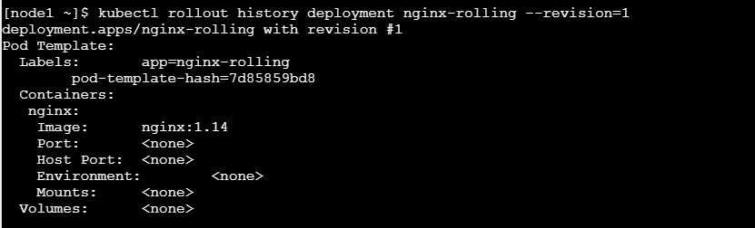
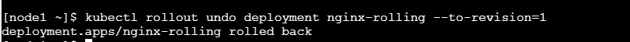
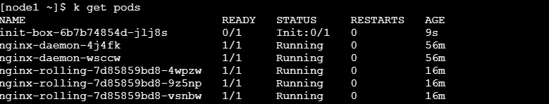

## Task 1: Create a 3 nodes cluster

###  Requirements:
Create a cluster with 1 master and 2 worker nodes


###  Answer

Do step 1 to step 4 in all nodes(3)
#### Step 1: Disable swap
To disable swap, simply remove the line with swap in /etc/fstab

```bash
sudo vim /etc/fstab
```

Comment out the line with swap


#### Step 2: Install docker run time

```bash
 sudo apt-get update
 sudo apt-get install \
    apt-transport-https \
    ca-certificates \
    curl \
    gnupg \
    lsb-release

curl -fsSL https://download.docker.com/linux/ubuntu/gpg | sudo gpg --dearmor -o /usr/share/keyrings/docker-archive-keyring.gpg

echo \
  "deb [arch=amd64 signed-by=/usr/share/keyrings/docker-archive-keyring.gpg] https://download.docker.com/linux/ubuntu \
  $(lsb_release -cs) stable" | sudo tee /etc/apt/sources.list.d/docker.list > /dev/null


 sudo apt-get update
 sudo apt-get install docker-ce docker-ce-cli containerd.io

```

#### Step 3: Configure cgroup
Switch to root and run

```bash
cat > /etc/docker/daemon.json <<EOF
{
  "exec-opts": ["native.cgroupdriver=systemd"],
  "log-driver": "json-file",
  "log-opts": {
    "max-size": "100m"
  },
  "storage-driver": "overlay2",
  "storage-opts": [
    "overlay2.override_kernel_check=true"
  ]
}
EOF

systemctl restart docker

```

#### Step 4: Install kubeadm, kubelet, kubectl

```bash
sudo curl -fsSLo /usr/share/keyrings/kubernetes-archive-keyring.gpg https://packages.cloud.google.com/apt/doc/apt-key.gpg

echo "deb [signed-by=/usr/share/keyrings/kubernetes-archive-keyring.gpg] https://apt.kubernetes.io/ kubernetes-xenial main" | sudo tee /etc/apt/sources.list.d/kubernetes.list

sudo apt-get update
sudo apt-get install -y kubelet kubeadm kubectl
sudo apt-mark hold kubelet kubeadm kubectl

```

Now, that's all the common commands you need to run on all nodes. Next comes the command you only run on the master node:

#### Step 5: start master node

```bash
kubeadm init
```

You should see similar message after a few minutes:


Copy the `kubeadm join...` command to later run on worker nodes.


Finally, you need to install network plugin for the master node (super important!)

```bash
sudo kubectl apply -f "https://cloud.weave.works/k8s/net?k8s-version=$(sudo kubectl version | base64 | tr -d '\n')"
```

Wait for a few minutes for the master node to be ready. You can run:
```bash
kubectl cluster-info
```

and wait until the status of the master node is `Ready`

#### Step 6: Join the cluster on worker nodes

Then, switch to the worker node and run the join command (the one you got after `kubeadm init`)

```bash
kubeadm join 192.168.1.98:6443 --token 0mfz2s.4xt0waiyfnpxiyt9 \
        --discovery-token-ca-cert-hash sha256:12e48d3bbfb435536618fc293a77950c13ac975fbea934c49c39abe4b7335ce1
```

Back to the master node and run
```bash
watch kubectl get nodes
```

It will watch the cluster and after a few minutes, you should see all the nodes are ready:


Congratulations! You have successfully setup a kubernetes cluster


## Task 2 : Using curl to explore the API

###  Requirements
Use `curl` instead of `kubectl` to get information about the cluster (pods...)


###  Answer
`kubectl` uses `curl` to access the Kubernetes API.


Use `kube-proxy` to avoid using certificate files

```bash
    kubectl proxy --port=9900 &

```

Now you can access the Kubernetes API using `curl`

```bash
    # Remember, it's http, not https
    curl http://localhost:9900
```

Some examples accessing resources using curl

```bash 
## Get pods in all namespaces
curl http://localhost:9900/api/v1/pods


## Get pods in the default namespace

curl http://localhost:9900/api/v1/namepsaces/default/pods
```


## Task 3: Create a deployment that run ONE nginx pod in all nodes of the cluser

###  Requirements
Create a deployment that run one nginx pod in every node of the cluster, including the master node


###  Answer
Daemonset is perfect to meet the requriements
Daemonset makes sure the pod run one instance in all nodes of the cluster.
Tolerations are needed to make sure pod runs on master node too.

Create this yaml file (name it, for example, nginx-daemon.yaml):
```yaml
apiVersion: apps/v1
kind: DaemonSet
metadata:
  name: nginx-daemon
  labels:
    app: nginx-daemon
spec:
  selector:
    matchLabels:
      name: nginx-daemon-pod
  template:
    metadata:
      labels:
        name: nginx-daemon-pod
    spec:
      tolerations:
      - key: node-role.kubernetes.io/master
        operator: Exists
        effect: NoSchedule
      containers:
      - name: nginx-daemon
        image: nginx
```


```bash
kubectl apply -f nginx-daemon.yaml
```

Check if the pods are up and available at all nodes:
```bash
kubectl get nodes -o wide
```


## Task 4: Create and scale a deployment

###  Requirement
Create a deployment using nginx image with 1 replica.
Then, scale the deployment to 2 replicas


###  Answer
To quickly create a deployment, use `kubectl create`

```bash 
kubectl create deploy nginx-deployment --image=nginx --replicas=1
```


Now scale the deployment to 2 replicas:

```bash 

kubectl scale deployment nginx-deployment --replicas=2 
```


The scale command can also be used with replicaset, statefulset, replicationcontroller(deprecated)


## Task 5: Perform a rolling update/rollback of a deployment

###  Requirements:
- Create a deployment named `nginx-rolling` with 3 pods using nginx:1.14 image
- Update the deployment to nginx:1.16
- Rollback the deployment to 1.14 using rollout history
- During the update, max unavailable is 2

###  Answer
Create deployment using `kubectl create` using dry-run (so we can quickly create the deployment) and 
add the additional info about the rolling update.

```bash 
kubectl create deploy nginx-rolling --image=nginx:1.14 --replicas=3 --dry-run=client -o yaml > nginx-rolling.yaml

```

Edit the yaml file to add `maxUnavailable` value:

```yaml
apiVersion: apps/v1
kind: Deployment
metadata:
  creationTimestamp: null
  labels:
    app: nginx-rolling
  name: nginx-rolling
spec:
  replicas: 3
  selector:
    matchLabels:
      app: nginx-rolling
  strategy:
    rollingUpdate:
      maxUnavailable: 2
  template:
    metadata:
      creationTimestamp: null
      labels:
        app: nginx-rolling
    spec:
      containers:
      - image: nginx:1.14
        name: nginx
        resources: {}
status: {}
```

Next, create the deployment

```bash
kubectl apply -f nginx-rolling.yaml
```

Now, update the deployment to use nginx:1.16 by editing the deployment yaml file, 
change nginx:1.14 to nginx:1.16 the run `kubectl apply -f nginx-rolling.yaml` again:

```bash 
kubectl apply -f nginx-rolling.yaml
```


Now, let's rollback to the previous deployment
First, get the rollout history:
```bash
kubectl rollout history deploy nginx-rolling
```


You can check the details of the revisions to make sure the version of the image is correct:

```bash 
kubectl rollout history deployment nginx-rolling --revision=1

```


It seems we need to roll back to revision 1

```bash

kubectl rollout undo deployment nginx-rolling --to-revision=1
```



Checking the details of the `nginx-rolling` deployment should show nginx image at 1.14


## Task 6: Using init containers

###  Requirements:
- Create a deployment name init-box using busybox as init container that sleep for 20 seconds.
- After 20 seconds, that container writes "wake up" to stdout (which can be seen )
- That deployment should also use nginx 1.16 as main container


###  Answer
Create this yaml file named sleep.yaml or whatever name you like
```yaml
apiVersion: apps/v1
kind: Deployment
metadata:
  labels:
    app: init-box
  name: init-box
spec:
  replicas: 1
  selector:
    matchLabels:
      app: init-box
  template:
    metadata:
      labels:
        app: init-box
    spec:
      initContainers:
        - image: busybox
          name: busy-start
          command: ['/bin/sh', '-c']
          args: ["sleep 20; echo 'wake up'"]
      containers:
      - image: nginx:1.16
        name: nginx
        resources: {}
status: {}
```

Now run:
```yaml
kubectl apply -f sleep.yaml

```

Get the pods:


After 20 seconds, you can see the log using:

```bash
kubectl logs init-box-6b7b74854d-jlj8s -c busy-start 

```


As you can see, you can use `-c container_name` to get the log of a specific container. As in the yaml file above,
the init container is named `busy-start`, you can get its log by using `-c busy-start`


## Task 7: Create statefulset
TODO


## Task 8: Create a volume and share between containers in a pod

###  Requirements